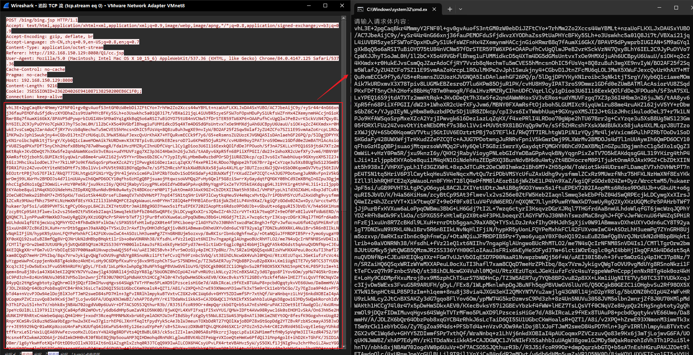

## 一、简介

本脚本基于 [冰蝎 3 JSP Shell 流量分析](https://www.freebuf.com/articles/web/285204.html) 一文中的代码进行二次开发。

使用前需要提前安装好依赖：`pip install -r requirements.txt`。

脚本运行前需先获取冰蝎的连接密钥。常见的获取方式包括：

- **冰蝎 2.x** 在连接成功后的首个流量包中可以直接获取明文的连接密钥；
- **冰蝎 3.x** 使用固定连接密钥，需要定位后门 WebShell 文件，并提取其中的密钥字符串；
- **历史流量分析**，可尝试从攻击者上传后门文件时的原始数据中提取密钥，例如分析上传行为对应的 HTTP 请求包。

## 二、请求包解密

### 2.1 填写连接密钥

- 编辑 `request.py` 文件：

  

### 2.2 开始解密

- 运行脚本后，直接将请求体内容复制到终端：

  

- 执行完成后，会在脚本目录下生成一个 `request.class` 文件，使用工具 [bytecode-viewer](https://github.com/Konloch/bytecode-viewer) 将它反编译得到攻击者执行的命令：

  

## 三、响应包解密

### 3.1 填写连接密钥

- 编辑 `response.py` 文件：

  

### 3.2 开始解密

> 数据复制到终端后，要按两次回车才会运行。

#### 3.2.1 Burp Suite 截取的流量包

- 运行脚本，Burp Suite 切换到 Hex(十六进制) 下，复制响应包全部内容到终端：

  

- 也可以只复制响应体：

  

#### 3.2.2 WireShark 截取的流量包

方法一：

- WireShark 过滤条件 `ip.src==<受控目标的 IP>`，然后找到后面有 "TCP PDU reassembled in xx" 标志的数据包：

  

- 运行脚本，在 WireShark 右下角的响应包显示处，右键选择 "...as a Hex Stream" 复制到终端：

  

方法二（推荐）：

- WireShark 追踪流，找到响应结果：

  

- WireShark 在下面选择 "原始数据"，运行脚本，然后复制蓝色代码到终端：

  
